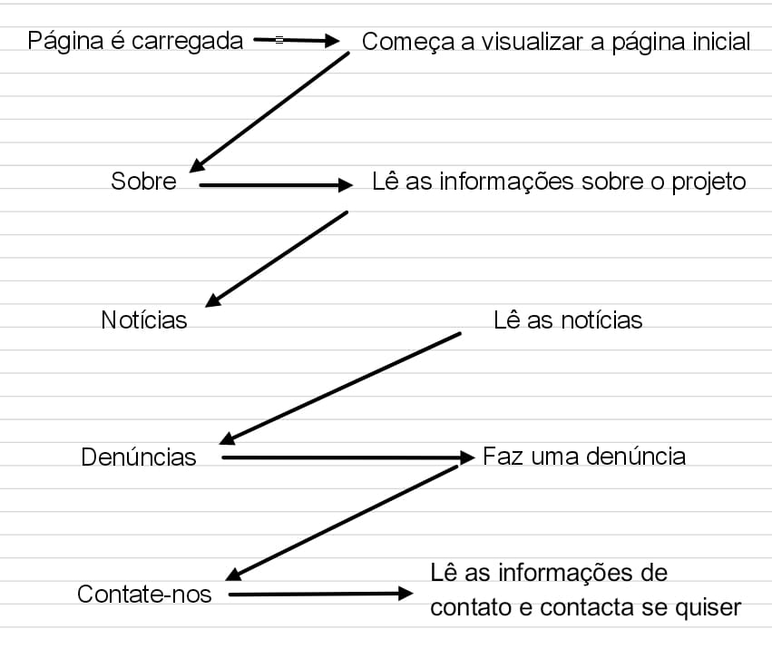
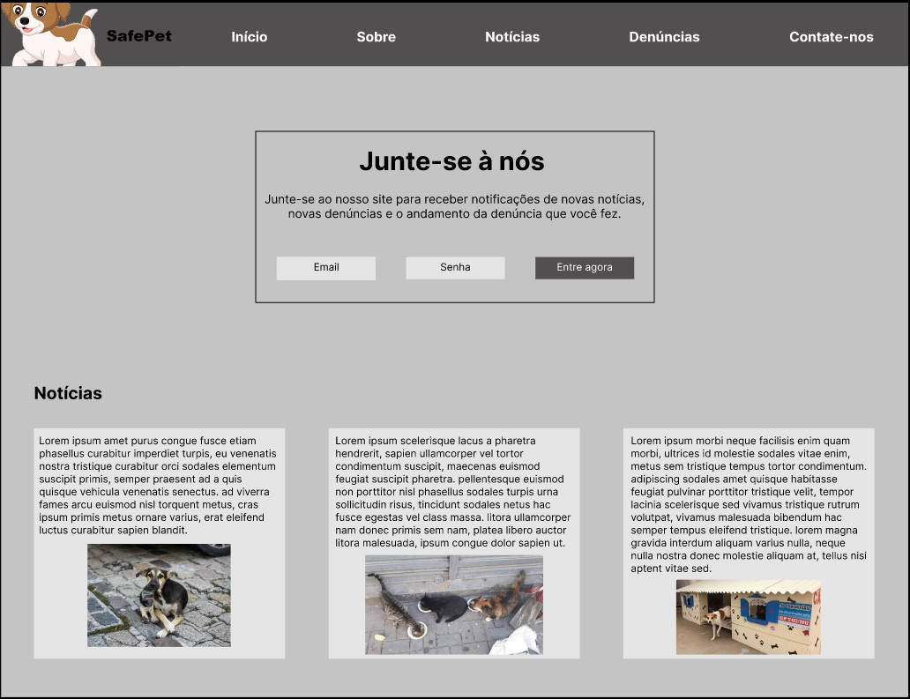
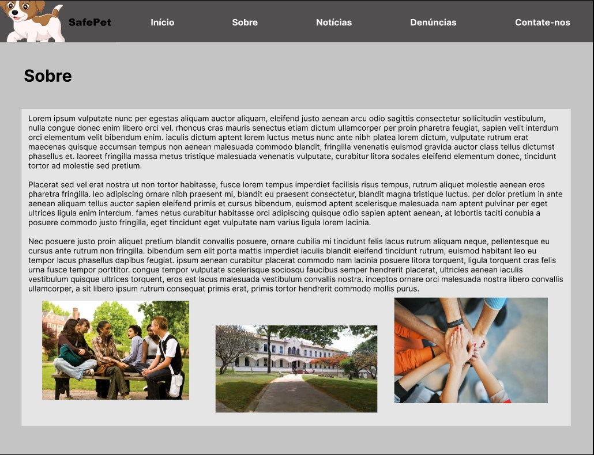
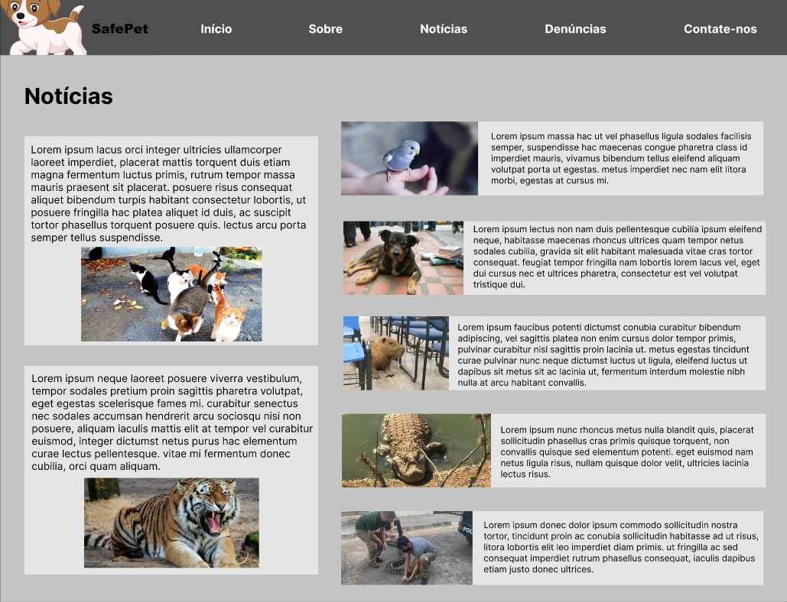
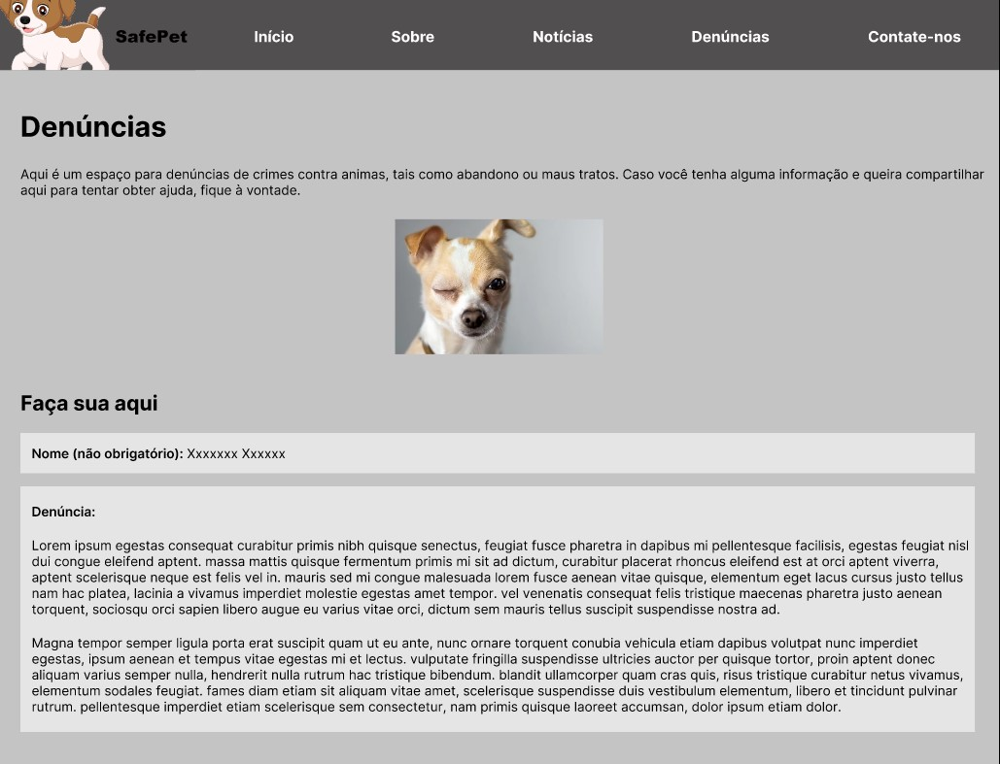
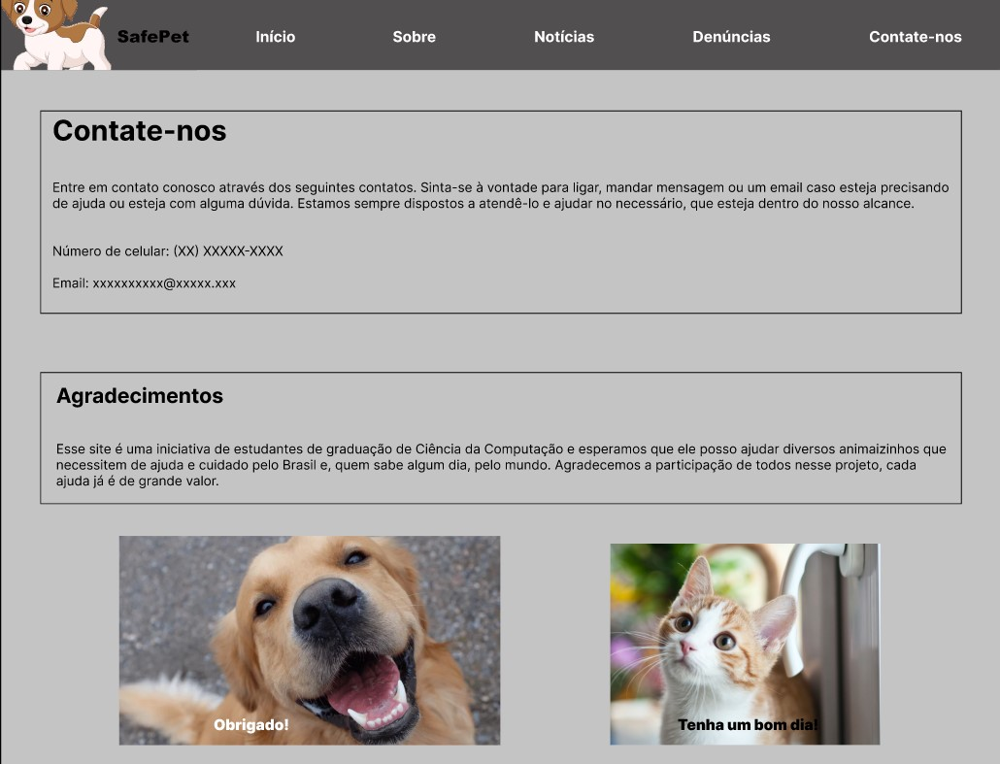

# Informações do Projeto
`SafePet`  

Trabalho interdisciplinar: Aplicações Web - Abandono de animais

`CURSO` 

 Ciência da Computação - Manhã - Unidade Coreu

## Participantes

Membros:
- Otávio Bruno de Barros Motta
- Áulus Arcanjo Alves Batista
- Lara Brígida Rezende Souza 
- Lucas Bigão Machado Gonçalves
- Marcelo Reis Esteves

# Estrutura do Documento

- [Informações do Projeto](#informações-do-projeto)
  - [Participantes](#participantes)
- [Estrutura do Documento](#estrutura-do-documento)
- [Introdução](#introdução)
  - [Problema](#problema)
  - [Objetivos](#objetivos)
  - [Justificativa](#justificativa)
  - [Público-Alvo](#público-alvo)
- [Especificações do Projeto](#especificações-do-projeto)
  - [Personas e Mapas de Empatia](#personas-e-mapas-de-empatia)
  - [Histórias de Usuários](#histórias-de-usuários)
  - [Requisitos](#requisitos)
    - [Requisitos Funcionais](#requisitos-funcionais)
    - [Requisitos não Funcionais](#requisitos-não-funcionais)
  - [Restrições](#restrições)
- [Projeto de Interface](#projeto-de-interface)
  - [User Flow](#user-flow)
  - [Wireframes](#wireframes)
- [Metodologia](#metodologia)
  - [Divisão de Papéis](#divisão-de-papéis)
  - [Ferramentas](#ferramentas)
  - [Controle de Versão](#controle-de-versão)
- [**############## SPRINT 1 ACABA AQUI #############**](#-sprint-1-acaba-aqui-)
- [Projeto da Solução](#projeto-da-solução)
  - [Tecnologias Utilizadas](#tecnologias-utilizadas)
  - [Arquitetura da solução](#arquitetura-da-solução)
- [Avaliação da Aplicação](#avaliação-da-aplicação)
  - [Plano de Testes](#plano-de-testes)
  - [Ferramentas de Testes (Opcional)](#ferramentas-de-testes-opcional)
  - [Registros de Testes](#registros-de-testes)
- [Referências](#referências)

# Introdução

## Problema

Atualmente, o abandono de animais é um problema enraizado na 
sociedade brasileira. De acordo com a OMS, existem mais de 30
milhões de animais abandonados no Brasil. abandono gera nesses 
animais grande sofrimento, afetando sua saúde e bem-estar, 
deixando-os sujeitos a maus-tratos e acidentes, diminuindo assim 
sua expectativa de vida. Além disso, o problema aflige a sociedade
no geral, já que estes animais podem transmitir doenças, contribuem
para a contaminação do meio ambiente onde estão inseridos e se
reproduzem desenfreadamente.

## Objetivos

O SafePet(Exemplo) tem como objetivo auxiliar na resolução do 
problema de visibilidade acerca dessa problemática. O projeto foca 
na ideia da construção de uma plataforma de conscientização sobre o
abandono de animais, formas de denúncia, formas de adoção e 
informações importantes antes de se obter um pet.

## Justificativa

Segundo a instituição Ampara Animal, que atua no auxílio de animais
abandonado, o abandono cresceu 61% entre junho de 2020 e março 
de 2021. Assim, percebe-se as consequências da falta de visibilidade
e conscientização acerca do assunto. Muitas pessoas tomam decisões
precipitadas, baseadas em uma falta de conhecimento, adotando ou 
comprando animais, sem entender as reponsabilidades, ou não possuem
conhecimento suficiente sobre a importância de se denunciar casos
de abandono. Assim, é visivel a importância de um projeto como
o SafePet(exemplo), fornecendo uma solução a essa falta de
conhecimento.

## Público-Alvo

O projeto pode servir para uma ampla faixa de público-alvo, já que
pode beneficiar a sociedade de forma geral. Porém, estabeleceu-se 
o foco em homens e mulheres, na faixa dos 17 aos 45 anos, que tem
interesse na causa, porém não possuem conhecimento suficiente e 
buscam se atualizar mais.

 
# Especificações do Projeto

Neste tópico, será feita um aprofundamento do projeto, com a 
introdução das Personas, Histórias de Usuários, Requisitos e 
Restrições do projeto.

## Personas e Mapas de Empatia

- **Lívia** tem 31 anos e é médica em um hospital público de Belo Horizonte.
Ama os animais, e tem interesse em saber mais sobre a situação de 
animais em situação de abandono, principalmente sobre a forma 
correta de denunciar animais, pois já testemunhou varios casos
de abandono perto do hospital onde trabalha, mas não possui 
tempo para procurar sobre em várias fontes diferentes, pois 
tem uma rotina cheia devido ao trabalho e plantões que realiza
constantemente.

- **Gabriel** tem 21 anos, é um estudante de veterinária e tem grande 
interesse em ajudar animais abandonados. Sonha em se formar e 
trabalhar auxiliando ONGs e instituições de apoio a estes animais,
porém sua maior dificuldade é o tempo gasto procurando informações
sobre o tema, já que precisa procurar dados em diferentes fontes e
plataformas.

- **Daniel** tem 45 anos, é professor universitário e possui uma pequena 
ONG chamada Amigo Animal, que realiza resgates e ajuda na doação de
animais abandonados, porém sofre com a falta de recursos e não 
consegue melhorar a quantia de doações.

## Histórias de Usuários

Com base na análise das personas forma identificadas as seguintes histórias de usuários:

| EU COMO... `PERSONA` | QUERO/PRECISO ... `FUNCIONALIDADE`                                            | PARA ... `MOTIVO/VALOR`                                     |
|----------------------|-------------------------------------------------------------------------------|-------------------------------------------------------------|
| Livia Esteves        | conhecer as formas corretas de denunciar casos de abandono animal             | pois testemunha frequentemente casos de abandono.           |
| Gabriel Mendonça     | conseguir procurar informações sobre o tema de forma mais rápida e eficiente. | para poder ajudar mais na resolução do problema.            |
| Daniel Barbosa       | conseguir divulgar melhor o trabalho de sua ONG                               | para conseguir mais recursos e poder ajudar mais animais.   |

## Requisitos

As tabelas que se seguem apresentam os requisitos funcionais e não funcionais que detalham o escopo do projeto.

### Requisitos Funcionais

| ID     | Descrição do Requisito                                        | Prioridade |
|--------|---------------------------------------------------------------|------------|
| RF-001 | Permitir que o usuário veja informações de forma ágil.        | ALTA       | 
| RF-002 | Mostrar ao usuário formas eficientes de denuncia              | ALTA       |
| RF-003 | Permitir que o usuário poste informações sobre ONGs onde atua | ALTA       |
| RF-004 | Fornecer notícias e informações para conscientizar o usuário  | ALTA       |
| RF-005 | Mostrar formas de adoção de animais                           | MÉDIA      |

### Requisitos não Funcionais

|ID     | Descrição do Requisito                      | Prioridade |
|-------|---------------------------------------------|------------|
|RNF-001| O sistema deve rodar em dispositivos móveis | ALTA       | 
|RNF-002| A aplicação deve ser de fácil utilização    | ALTA       | 

## Restrições

O projeto está restrito pelos itens apresentados na tabela a seguir.

| ID     | Restrição                                                               |
|--------|-----------------------------------------------------------------------------|
| RE-001 | O projeto deverá ser entregue até o final do semestre                       | 
| RE-002 | O aplicativo deve se restringir ás tecnologias básicas da Web no Frontend   | 

# Projeto de Interface

Dentre as preocupações para a montagem da interface do sistema, estamos estabelecendo 
foco em questões como agilidade, acessibilidade e usabilidade. Desta forma, o projeto 
tem uma identidade visual padronizada em todas as telas que são projetadas para 
funcionamento em desktops e dispositivos móveis.

## User Flow

O esquema mostra o fluxo de interação nas telas do sistema pelo qual o usuário passará. Cada tela é detalhada na 
seção de wireframes que se segue.

## Wireframes

### Tela inicial

### Tela Sobre

### Tela Notícias

### Tela Denúncias

### Tela Contate-nos

### Protótipo funcional 

Link: https://www.figma.com/proto/ms8QkIaNINlzEgvPDsTQkP/TIAW---Abandono-de-animais?node-id=5%3A90&scaling=scale-down&page-id=0%3A1&starting-point-node-id=5%3A90

# Metodologia

Nosso grupo se aproveitou do tempo reunido em sala para conseguir se organizar e dividir as
tarefas. Cada membro teve a liberdade para escolher a ferramenta que quisesse para realizar
sua tarefa.

## Divisão de Papéis

Otávio
* Contexto do projeto (Introdução, Problema, Objetivo do projeto, Justificativa e Público-alvo)
* Especificação do Projeto (Histórias de usuários, requisitos funcionais, requisitos não
funcionais e restrições do projeto)
* Repositório Github

Marcelo
* Metodologia (Organização da equipe e divisão de papéis, Quadro de controle de tarefas -
Kanban, fluxo de trabalho no GitHub)
* Apresentação

Aulus
* Apresentação

Lara
* Projeto de Interface (Fluxo do usuário, Wireframes das telas, Protótipo Interativo [LINK])

## Ferramentas

......  COLOQUE AQUI O SEU TEXTO - SIGA O EXEMPLO DA TABELA ABAIXO  ......

| Ambiente  | Plataforma  | Link de Acesso |
|-----------|-------------|---------|
|Processo de Design Thinkgin  | Miro | https://miro.com/app/board/uXjVO_g8ET4=/        | 
|Repositório de código | GitHub | https://github.com/ICEI-PUC-Minas-PMGCC-TI/tiaw-pmg-cc-m-20221-tiaw-abandono-de-animais-grupo-1 | 
|Protótipo Interativo | Figma | https://www.figma.com/proto/ms8QkIaNINlzEgvPDsTQkP/TIAW---Abandono-de-animais?node-id=5%3A90&scaling=scale-down&page-id=0%3A1&starting-point-node-id=5%3A90 | 

## Controle de Versão

* Utilizamos a ferramenta git e github, usados respectivamente para o controle de versão e do
repositório.
* Na gerencia de issues, não utilizamos tags e issues.

# **############## SPRINT 1 ACABA AQUI #############**

# Projeto da Solução

......  COLOQUE AQUI O SEU TEXTO ......

## Tecnologias Utilizadas

......  COLOQUE AQUI O SEU TEXTO ......

> Descreva aqui qual(is) tecnologias você vai usar para resolver o seu
> problema, ou seja, implementar a sua solução. Liste todas as
> tecnologias envolvidas, linguagens a serem utilizadas, serviços web,
> frameworks, bibliotecas, IDEs de desenvolvimento, e ferramentas.
> Apresente também uma figura explicando como as tecnologias estão
> relacionadas ou como uma interação do usuário com o sistema vai ser
> conduzida, por onde ela passa até retornar uma resposta ao usuário.
> 
> Inclua os diagramas de User Flow, esboços criados pelo grupo
> (stoyboards), além dos protótipos de telas (wireframes). Descreva cada
> item textualmente comentando e complementando o que está apresentado
> nas imagens.

## Arquitetura da solução

......  COLOQUE AQUI O SEU TEXTO E O DIAGRAMA DE ARQUITETURA .......

> Inclua um diagrama da solução e descreva os módulos e as tecnologias
> que fazem parte da solução. Discorra sobre o diagrama.
> 
> **Exemplo do diagrama de Arquitetura**:
> 
> 

# Avaliação da Aplicação

......  COLOQUE AQUI O SEU TEXTO ......

> Apresente os cenários de testes utilizados na realização dos testes da
> sua aplicação. Escolha cenários de testes que demonstrem os requisitos
> sendo satisfeitos.

## Plano de Testes

......  COLOQUE AQUI O SEU TEXTO ......

> Enumere quais cenários de testes foram selecionados para teste. Neste
> tópico o grupo deve detalhar quais funcionalidades avaliadas, o grupo
> de usuários que foi escolhido para participar do teste e as
> ferramentas utilizadas.
> 
> **Links Úteis**:
> - [IBM - Criação e Geração de Planos de Teste](https://www.ibm.com/developerworks/br/local/rational/criacao_geracao_planos_testes_software/index.html)
> - [Práticas e Técnicas de Testes Ágeis](http://assiste.serpro.gov.br/serproagil/Apresenta/slides.pdf)
> -  [Teste de Software: Conceitos e tipos de testes](https://blog.onedaytesting.com.br/teste-de-software/)

## Ferramentas de Testes (Opcional)

......  COLOQUE AQUI O SEU TEXTO ......

> Comente sobre as ferramentas de testes utilizadas.
> 
> **Links Úteis**:
> - [Ferramentas de Test para Java Script](https://geekflare.com/javascript-unit-testing/)
> - [UX Tools](https://uxdesign.cc/ux-user-research-and-user-testing-tools-2d339d379dc7)

## Registros de Testes

......  COLOQUE AQUI O SEU TEXTO ......

> Discorra sobre os resultados do teste. Ressaltando pontos fortes e
> fracos identificados na solução. Comente como o grupo pretende atacar
> esses pontos nas próximas iterações. Apresente as falhas detectadas e
> as melhorias geradas a partir dos resultados obtidos nos testes.

# Referências

......  COLOQUE AQUI O SEU TEXTO ......

> Inclua todas as referências (livros, artigos, sites, etc) utilizados
> no desenvolvimento do trabalho.
> 
> **Links Úteis**:
> - [Formato ABNT](https://www.normastecnicas.com/abnt/trabalhos-academicos/referencias/)
> - [Referências Bibliográficas da ABNT](https://comunidade.rockcontent.com/referencia-bibliografica-abnt/)